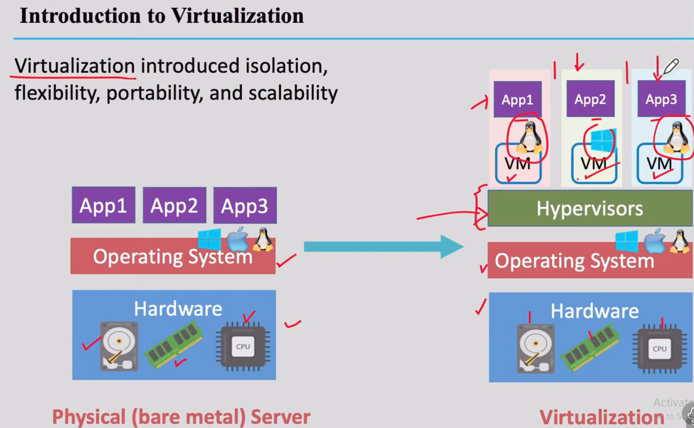
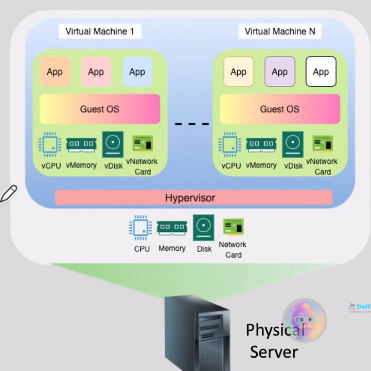

A server is basically a powerful computing device with:
- A good size memory
- One or more CPUs(RAM)
- One or more disk drives to persistently store the operating system, applications, and data
- One or more network interfaces
- One or ore GCPUs
- An operating system (Windows, Linux, MacOS)

## Scaling Servers
As the number of users increases,
- The server perfomance my degrade
- We need to increase (scale ) the number of servers

## Server Hosting on Datacenters
- A data center is an air conditioned, secure, and monitored space
- Thousands of rows

## Server Resourse Optimization and mutiple apps on a server
To optimize resource usage, multiple applications could be run on the same physical server
- Each application may require its own runtime version, depedencies, database..etc

Drawbacks:
- Resource contention and inefficiency
- Dependency conflicts
- Lack of strong isolation - Security risks
- Scaling is painful
- Deployment and maintenance hell
- Lack of portability

## Introduction to Virtualization
Virtualization introduced isolation, flexibilty, portability, and scalability

Virtualization enable us to run more than one virtual machine, multiple operating systems, and application on a single physical server
- Virtual machines are isolated
- We can take a snapshot of the VM (a backup)
   - A VM is a set of files
```

```

## Virtual Machine (VM) Resources
The hypervisor shares the physical server resources among the virtual machine (VMs)

Each VM gets its:
- Virtual Network interface card(vNIC)
- Virtual Disk(vDisk)
- Virtual RAM (vRAM)
- Virtual CPU(s) (vCPU)

## Popular Hypervisors Providers
- VMware vSphere
- Xen
- Microsoft Hyper-V
- Linux KVM
- Oracle VM VirtualBox
- VMware Wrorkstation

## VMs - Issues
- Heavyweight( slow to start )
- Limited Scalability
- Poor Dev/ Test/ Prod parity
- Reduntant OS overhead
- Inefficient Image Management

```

```
1. Laptop
1. Physical Server


# Virtualization to Container

## Linux Software Process Overview
A process is a running instance of a program that has its own memory, CPU context and system resouces, managed by he Linux kernel

When you run a program (like bash, nginx, or python), the Linux kernel:
1. Loads the program's code into memory
2. Allocates it a **Unique Process ID** (`PID`)
3. Crates a process to execute the code
