# SQL Revision — Complete Notes

> **Level**: Intermediate → Experienced  
> Comprehensive SQL reference covering CRUD, joins, indexing, transactions, normalization, and real-world patterns.  
> Covers MySQL/PostgreSQL syntax with performance insights and interview-ready explanations.

---

## Table of Contents

1. [Architecture Overview](#-architecture-overview)
2. [DELETE Statement](#-delete-statement)
3. [UPDATE Statement](#-update-statement)
4. [Pagination](#-pagination)
5. [Polymorphic Tables (LIKES)](#-polymorphic-tables---likes-example)
6. [Foreign Keys & Referential Integrity](#-foreign-keys--referential-integrity)
7. [Joins — Complete Guide](#-joins--complete-guide)
8. [Indexes & Query Optimization](#-indexes--query-optimization)
9. [Transactions & ACID](#-transactions--acid-properties)
10. [Normalization](#-normalization)
11. [Aggregations & GROUP BY](#-aggregations--group-by)
12. [Subqueries & CTEs](#-subqueries--ctes)
13. [Views & Materialized Views](#-views--materialized-views)
14. [Database Design Patterns](#-database-design-patterns)
15. [Interview Quick Reference](#-interview-quick-reference)

---

## Architecture Overview

### How a SQL Query Executes


### Database Storage Layers


---

## DELETE Statement

```sql
DELETE FROM POSTS WHERE ID = 1;
```

### How it Works


### Key Concepts

| Aspect | Detail |
|---|---|
| **Row-by-row** | DELETE processes one row at a time |
| **Rollback-safe** | Can be rolled back inside a transaction |
| **Logging** | Each deleted row is logged in the undo/WAL log |
| **Trigger-aware** | `ON DELETE` triggers fire per row |
| **Without WHERE** | Deletes **ALL** rows (dangerous!) |

### DELETE vs TRUNCATE vs DROP

| Feature | `DELETE` | `TRUNCATE` | `DROP` |
|---|---|---|---|
| Removes rows | ✅ Conditional | ✅ All rows | ✅ Entire table |
| WHERE clause | ✅ Yes | ❌ No | ❌ No |
| Rollback | ✅ Yes | ⚠️ DB-dependent | ❌ No |
| Speed | 🐢 Slow (row-by-row) | ⚡ Fast (drop + recreate) | ⚡ Instant |
| Triggers | ✅ Fire | ❌ Don't fire | ❌ Don't fire |
| Auto-increment | Keeps counter | Resets counter | Table gone |

```sql
-- Delete all rows (slow)
DELETE FROM POSTS;

-- Truncate — drops and recreates the table (fast)
TRUNCATE TABLE COMMENTS;

-- Batch delete for large datasets (prevents locking)
DELETE FROM POSTS WHERE CREATED_AT < '2023-01-01' LIMIT 1000;
```

> **Experienced Insight**: In production, never run `DELETE` without `LIMIT` on large tables. Use batched deletes with a loop:
> ```sql
> -- Batch delete pattern (run in a loop until 0 rows affected)
> DELETE FROM logs WHERE created_at < '2024-01-01' LIMIT 5000;
> -- Sleep 100ms between batches to reduce replication lag
> ```

---

## UPDATE Statement

```sql
UPDATE POSTS SET CONTENT = 'MY WORLD' WHERE ID = 2;
```

### How UPDATE Works Internally


### Rules & Best Practices

- **Always use WHERE** unless intentionally updating all rows
- Multiple columns: `UPDATE POSTS SET CONTENT = 'New', TITLE = 'New Title' WHERE ID = 2;`
- Updating indexed columns = index rebuild overhead
- Frequent updates on the same row → **row versioning bloat** (PostgreSQL MVCC)

```sql
-- Dangerous: updates ALL rows
UPDATE POSTS SET CONTENT = 'HELLO';

-- Safe: targets specific row
UPDATE POSTS SET CONTENT = 'New Content', TITLE = 'New Title' WHERE ID = 2;
```

> **Experienced Insight**: In PostgreSQL, `UPDATE` creates a **new tuple** (MVCC). Dead tuples pile up → run `VACUUM` regularly. In MySQL/InnoDB, updates happen **in-place** with undo logs.

---

## Pagination

### The Problem

Loading 1M rows at once = crashed browser / OOM server. Pagination fetches data in **chunks**.

### OFFSET-Based Pagination

```sql
-- Page 1: first 10 rows
SELECT * FROM USERS LIMIT 10 OFFSET 0;

-- Page 2: next 10 rows
SELECT * FROM USERS LIMIT 10 OFFSET 10;

-- Generic formula
SELECT * FROM USERS LIMIT :page_size OFFSET (:page - 1) * :page_size;
```

### OFFSET Performance Problem


> As `OFFSET` grows, the DB must scan and **discard** more rows — **O(n)** per page!

### Cursor-Based Pagination (Keyset Pagination) ⚡

```sql
-- Instead of OFFSET, use the last seen ID
SELECT * FROM USERS WHERE ID > 100 LIMIT 10;

-- Next page: use the last ID from previous result
SELECT * FROM USERS WHERE ID > 110 LIMIT 10;
```

### Comparison

| Feature | OFFSET-Based | Cursor-Based |
|---|---|---|
| Speed at page 1 | ⚡ Fast | ⚡ Fast |
| Speed at page 10,000 | 🐢 Very slow | ⚡ Still fast |
| Jump to page N | ✅ Yes | ❌ No |
| Consistent with inserts | ❌ Rows shift | ✅ Stable |
| Use case | Admin panels | Infinite scroll, APIs |

> **Experienced Insight**: Real-world APIs (Twitter, Slack, Stripe) all use **cursor-based pagination**. The cursor is usually an encoded `(timestamp, id)` tuple for sort stability.

---

## Polymorphic Tables — LIKES Example

### The Problem

A "Like" can belong to a **Post**, **Comment**, or **Reel**. Instead of 3 separate tables, use a **polymorphic association**:

```sql
CREATE TABLE LIKES (
    ID INT PRIMARY KEY AUTO_INCREMENT,
    USER_ID INT NOT NULL,
    CREATED_AT TIMESTAMP DEFAULT CURRENT_TIMESTAMP,
    LIKEABLE_ID INT NOT NULL,
    LIKEABLE_TYPE ENUM('POST', 'COMMENT')
);
```

### Polymorphic Query Flow


### Adding a New Type

```sql
-- Add 'REEL' to the ENUM
ALTER TABLE LIKES MODIFY LIKEABLE_TYPE ENUM('POST', 'COMMENT', 'REEL');

-- Verify
DESC LIKES;

-- Insert a reel like
INSERT INTO LIKES(USER_ID, LIKEABLE_ID, LIKEABLE_TYPE) VALUES (1, 1, 'REEL');
```

### Pros & Cons of Polymorphic Tables

| Pros | Cons |
|---|---|
| Single table for all like types | Cannot use foreign keys (no FK on ENUM target) |
| Easy to add new types | Queries need `WHERE type = ...` filter |
| Less schema complexity | No DB-level referential integrity |

> **🔥 Experienced Insight**: Polymorphic associations are popular in ORMs (Rails, Laravel) but **break referential integrity**. At scale, prefer **separate join tables** (`post_likes`, `comment_likes`) or use **table inheritance** in PostgreSQL.

---

## 🔗 Foreign Keys & Referential Integrity

### What is a Foreign Key?

A foreign key is a column (or group of columns) that **references the primary key** of another table, enforcing data consistency.

### Entity Relationship


### Creating Tables with Foreign Keys

```sql
CREATE TABLE COMMENTS (
    ID INT PRIMARY KEY AUTO_INCREMENT,
    CONTENT VARCHAR(255) NOT NULL,
    USER_ID INT NOT NULL,
    POST_ID INT NOT NULL,
    CREATED_AT TIMESTAMP DEFAULT CURRENT_TIMESTAMP,
    FOREIGN KEY (USER_ID) REFERENCES USERS(ID),
    FOREIGN KEY (POST_ID) REFERENCES POSTS(ID)
);
```

### Cascade Actions

```sql
-- When a user is deleted, delete all their comments too
FOREIGN KEY (USER_ID) REFERENCES USERS(ID) ON DELETE CASCADE

-- When a post is deleted, set POST_ID to NULL in comments
FOREIGN KEY (POST_ID) REFERENCES POSTS(ID) ON DELETE SET NULL
```

| Action | Behavior |
|---|---|
| `CASCADE` | Delete/update child rows automatically |
| `SET NULL` | Set FK column to NULL |
| `RESTRICT` | Block parent deletion if children exist |
| `NO ACTION` | Same as RESTRICT (default) |
| `SET DEFAULT` | Set FK to default value |

> **🔥 Experienced Insight**: `ON DELETE CASCADE` is convenient but can cause **cascade storms** in production. A single user deletion could wipe posts → comments → likes → notifications. Prefer **soft deletes** (`is_deleted = true`) in production systems.

---

## 🔀 Joins — Complete Guide

### Visual Overview


### Join Flow — How the DB Engine Processes


### 1. INNER JOIN (Intersection)

Returns only rows where there's a match in **both** tables.

```sql
SELECT
    C.ID AS comment_id,
    C.CONTENT AS comment,
    U.NAME AS user_name,
    P.TITLE AS post_title
FROM COMMENTS C
INNER JOIN USERS U ON C.USER_ID = U.ID
INNER JOIN POSTS P ON C.POST_ID = P.ID;
```

### 2. LEFT JOIN (Left Outer Join)

Returns **all** rows from the left table, with NULLs for non-matching right rows.

```sql
-- Get all users, even those with no posts
SELECT U.NAME, P.TITLE
FROM USERS U
LEFT JOIN POSTS P ON U.ID = P.USER_ID;
```

**Use case**: Find users who have **never** posted:

```sql
SELECT U.NAME
FROM USERS U
LEFT JOIN POSTS P ON U.ID = P.USER_ID
WHERE P.ID IS NULL;
```

### 3. RIGHT JOIN

Returns **all** rows from the right table. (Rarely used — rewrite as LEFT JOIN)

```sql
SELECT U.NAME, P.TITLE
FROM POSTS P
RIGHT JOIN USERS U ON U.ID = P.USER_ID;
```

### 4. FULL OUTER JOIN

Returns all rows from **both** tables. MySQL doesn't support this natively — use UNION:

```sql
-- PostgreSQL
SELECT U.NAME, P.TITLE
FROM USERS U
FULL OUTER JOIN POSTS P ON U.ID = P.USER_ID;

-- MySQL workaround
SELECT U.NAME, P.TITLE FROM USERS U LEFT JOIN POSTS P ON U.ID = P.USER_ID
UNION
SELECT U.NAME, P.TITLE FROM USERS U RIGHT JOIN POSTS P ON U.ID = P.USER_ID;
```

### 5. CROSS JOIN (Cartesian Product)

Every row from A × every row from B. Rarely needed.

```sql
SELECT U.NAME, P.TITLE
FROM USERS U
CROSS JOIN POSTS P;
-- If USERS has 10 rows and POSTS has 5 → 50 rows returned
```

### 6. SELF JOIN

Join a table with itself. Useful for hierarchies.

```sql
-- Find employees and their managers
SELECT
    E.NAME AS employee,
    M.NAME AS manager
FROM EMPLOYEES E
LEFT JOIN EMPLOYEES M ON E.MANAGER_ID = M.ID;
```

### Join Performance Summary

| Algorithm | When Used | Time Complexity |
|---|---|---|
| **Nested Loop** | Small tables or indexed joins | O(n × m) |
| **Hash Join** | Large unindexed tables | O(n + m) |
| **Merge Join** | Pre-sorted data | O(n + m) |

> **🔥 Experienced Insight**: Always `EXPLAIN ANALYZE` your joins. The optimizer picks the algorithm, but **missing indexes on FK columns** force nested loops. Rule: **every FK column should have an index**.

---

## ⚡ Indexes & Query Optimization

### What is an Index?

An index is a **B+ Tree** data structure that allows O(log n) lookups instead of O(n) full table scans.

### Index Internals


### Creating Indexes

```sql
-- Single column index
CREATE INDEX idx_users_email ON USERS(EMAIL);

-- Composite index (order matters!)
CREATE INDEX idx_posts_user_created ON POSTS(USER_ID, CREATED_AT);

-- Unique index
CREATE UNIQUE INDEX idx_users_email_unique ON USERS(EMAIL);

-- Check existing indexes
SHOW INDEX FROM USERS;
```

### When to Index

| ✅ Index | ❌ Don't Index |
|---|---|
| Columns in WHERE clauses | Small tables (< 1000 rows) |
| JOIN columns (FK columns) | Columns with low cardinality (e.g., boolean) |
| ORDER BY columns | Frequently updated columns |
| High cardinality columns | Wide columns (TEXT, BLOB) |

### EXPLAIN — Reading Query Plans

```sql
EXPLAIN ANALYZE SELECT * FROM USERS WHERE EMAIL = 'john@example.com';
```

| Key Field | Meaning |
|---|---|
| `type: ref` | Index lookup ✅ |
| `type: ALL` | Full table scan ❌ |
| `rows` | Estimated rows scanned |
| `Extra: Using index` | Covered query (data from index only) |
| `Extra: Using filesort` | Sorting not using index ⚠️ |

> **🔥 Experienced Insight**: **Composite index order matters**. Index on `(A, B, C)` can serve queries on `(A)`, `(A, B)`, and `(A, B, C)` — but NOT `(B)` alone. This is the **leftmost prefix rule**.

---

## 🔒 Transactions & ACID Properties

### What is a Transaction?

A transaction groups multiple SQL statements into a single **atomic** unit — either **all succeed** or **all fail**.

### Transaction Flow

```mermaid
flowchart TD
    A["BEGIN TRANSACTION"] --> B["Debit ₹500 from Account A"]
    B --> C["Credit ₹500 to Account B"]
    C --> D{"Both Successful?"}
    D -->|"Yes"| E["COMMIT — Changes Permanent"]
    D -->|"No"| F["ROLLBACK — Undo Everything"]

    style A fill:#6C63FF,color:#fff
    style E fill:#43AA8B,color:#fff
    style F fill:#FF6584,color:#fff
```



### ACID Properties

| Property | Meaning | Example |
|---|---|---|
| **Atomicity** | All or nothing | Transfer: debit + credit both happen or neither |
| **Consistency** | DB moves from one valid state to another | Total balance before = total balance after |
| **Isolation** | Concurrent transactions don't interfere | Two transfers from same account don't overdraw |
| **Durability** | Committed data survives crashes | Written to WAL/redo log before confirming |

### SQL Example

```sql
BEGIN;

UPDATE ACCOUNTS SET BALANCE = BALANCE - 500 WHERE ID = 1;
UPDATE ACCOUNTS SET BALANCE = BALANCE + 500 WHERE ID = 2;

-- If both succeed
COMMIT;

-- If something goes wrong
ROLLBACK;
```

### Isolation Levels

| Level | Dirty Read | Non-Repeatable Read | Phantom Read | Performance |
|---|---|---|---|---|
| `READ UNCOMMITTED` | ✅ | ✅ | ✅ | ⚡ Fastest |
| `READ COMMITTED` | ❌ | ✅ | ✅ | Fast |
| `REPEATABLE READ` | ❌ | ❌ | ✅ | Medium |
| `SERIALIZABLE` | ❌ | ❌ | ❌ | 🐢 Slowest |

```sql
SET TRANSACTION ISOLATION LEVEL REPEATABLE READ;
BEGIN;
-- Your queries here
COMMIT;
```

> **🔥 Experienced Insight**: PostgreSQL defaults to `READ COMMITTED`, MySQL/InnoDB defaults to `REPEATABLE READ`. In high-concurrency systems, **optimistic locking** (version columns) often outperforms strict isolation levels.

---

## 📐 Normalization

### Why Normalize?

Eliminate **data redundancy** and ensure **data integrity**.

### Normal Forms


| Form | Rule | Example Violation |
|---|---|---|
| **1NF** | Every cell has a single atomic value | `skills = "JS, Python, Go"` → Should be separate rows |
| **2NF** | No partial dependency on composite key | `{student_id, course_id} → student_name` (depends only on student_id) |
| **3NF** | No transitive dependency | `student → dept → dept_head` (dept_head depends on dept, not student) |
| **BCNF** | Every determinant is a candidate key | Rare edge cases of 3NF violations |

### Denormalization

In production, we often **intentionally denormalize** for read performance:

```sql
-- Normalized: 3 JOINs to show a post with user and comment count
SELECT P.*, U.NAME, COUNT(C.ID)
FROM POSTS P
JOIN USERS U ON P.USER_ID = U.ID
LEFT JOIN COMMENTS C ON C.POST_ID = P.ID
GROUP BY P.ID;

-- Denormalized: add a counter column (updated via triggers/application)
ALTER TABLE POSTS ADD COLUMN comment_count INT DEFAULT 0;
SELECT P.*, U.NAME, P.comment_count FROM POSTS P JOIN USERS U ON P.USER_ID = U.ID;
```

> **🔥 Experienced Insight**: Normalize to **3NF** during design, then selectively denormalize based on **read patterns**. Instagram stores `like_count` directly on posts rather than `COUNT(*)` from likes table — this is intentional denormalization for performance.

---

## 📊 Aggregations & GROUP BY

### Common Aggregate Functions

```sql
SELECT
    COUNT(*) AS total_posts,
    COUNT(DISTINCT USER_ID) AS unique_authors,
    MAX(CREATED_AT) AS latest_post,
    MIN(CREATED_AT) AS oldest_post,
    AVG(LENGTH(CONTENT)) AS avg_content_length
FROM POSTS;
```

### GROUP BY with HAVING

```sql
-- Users who have more than 5 posts
SELECT USER_ID, COUNT(*) AS post_count
FROM POSTS
GROUP BY USER_ID
HAVING COUNT(*) > 5
ORDER BY post_count DESC;
```

### Query Execution Order


> **🔥 Experienced Insight**: `WHERE` filters **rows** before grouping, `HAVING` filters **groups** after grouping. `WHERE` can use indexes; `HAVING` cannot. Always prefer `WHERE` when possible.

---

## 🧩 Subqueries & CTEs

### Subquery (Nested Query)

```sql
-- Find users who have posted
SELECT NAME FROM USERS
WHERE ID IN (SELECT DISTINCT USER_ID FROM POSTS);

-- Correlated subquery — runs for EACH row (slow!)
SELECT U.NAME,
    (SELECT COUNT(*) FROM POSTS P WHERE P.USER_ID = U.ID) AS post_count
FROM USERS U;
```

### CTE (Common Table Expression) — Cleaner Alternative

```sql
WITH active_users AS (
    SELECT USER_ID, COUNT(*) AS post_count
    FROM POSTS
    GROUP BY USER_ID
    HAVING COUNT(*) > 5
)
SELECT U.NAME, A.post_count
FROM USERS U
JOIN active_users A ON U.ID = A.USER_ID;
```

### Recursive CTE — For Hierarchical Data

```sql
-- Org chart / category tree
WITH RECURSIVE org_tree AS (
    -- Base case: top-level managers
    SELECT ID, NAME, MANAGER_ID, 1 AS level
    FROM EMPLOYEES
    WHERE MANAGER_ID IS NULL

    UNION ALL

    -- Recursive case
    SELECT E.ID, E.NAME, E.MANAGER_ID, T.level + 1
    FROM EMPLOYEES E
    JOIN org_tree T ON E.MANAGER_ID = T.ID
)
SELECT * FROM org_tree ORDER BY level;
```

> **🔥 Experienced Insight**: CTEs **do not** always improve performance — in MySQL, CTEs are materialized (temp table). In PostgreSQL 12+, the optimizer can inline CTEs. Prefer **JOINs** for performance-critical queries.

---

## 👁️ Views & Materialized Views

### Regular View (Virtual Table)

A view is a **saved query** — not stored data. Recomputed on every access.

```sql
CREATE VIEW active_users_view AS
SELECT U.ID, U.NAME, COUNT(P.ID) AS post_count
FROM USERS U
JOIN POSTS P ON U.ID = P.USER_ID
GROUP BY U.ID
HAVING COUNT(P.ID) > 5;

-- Use like a table
SELECT * FROM active_users_view WHERE post_count > 10;
```

### Materialized View (PostgreSQL)

Pre-computed and **stored on disk**. Must be refreshed manually.

```sql
CREATE MATERIALIZED VIEW mv_user_stats AS
SELECT USER_ID, COUNT(*) AS post_count, MAX(CREATED_AT) AS last_post
FROM POSTS
GROUP BY USER_ID;

-- Refresh when underlying data changes
REFRESH MATERIALIZED VIEW CONCURRENTLY mv_user_stats;
```

| Feature | View | Materialized View |
|---|---|---|
| Data stored? | ❌ No (virtual) | ✅ Yes (on disk) |
| Always up-to-date? | ✅ Yes | ❌ No (manual refresh) |
| Read performance | Same as query | ⚡ Fast (pre-computed) |
| Supported | All RDBMS | PostgreSQL, Oracle |

> **🔥 Experienced Insight**: Materialized views are the secret weapon for **dashboard queries**. Refresh them on a cron schedule (e.g., every 5 minutes) instead of running expensive aggregations on every page load.

---

## 🏛️ Database Design Patterns

### Social Media Schema Example


### Common Patterns

| Pattern | Description | Example |
|---|---|---|
| **Soft Delete** | `is_deleted` flag instead of DELETE | User deactivation |
| **Audit Trail** | `created_by`, `updated_by`, `deleted_at` columns | Compliance |
| **Polymorphic FK** | `type` + `type_id` columns | Likes on posts/comments |
| **Counter Cache** | Store computed counts on parent | `posts.comment_count` |
| **UUID Primary Key** | Use UUIDs instead of auto-increment | Distributed systems |
| **Slug Column** | URL-friendly identifier | `/posts/my-first-blog` |

> **🔥 Experienced Insight**: In microservices, avoid cross-service JOINs. Each service owns its data. Use **event-driven sync** (Kafka/RabbitMQ) to keep denormalized copies in other services.

---

## 🎯 Interview Quick Reference

### SQL Order of Execution vs Writing Order

| Writing Order | Execution Order |
|---|---|
| `SELECT` | ① `FROM` / `JOIN` |
| `FROM` | ② `WHERE` |
| `WHERE` | ③ `GROUP BY` |
| `GROUP BY` | ④ `HAVING` |
| `HAVING` | ⑤ `SELECT` |
| `ORDER BY` | ⑥ `DISTINCT` |
| `LIMIT` | ⑦ `ORDER BY` |
| | ⑧ `LIMIT` / `OFFSET` |

### Common Interview Questions

| Question | Key Answer |
|---|---|
| DELETE vs TRUNCATE? | DELETE = row-by-row, logged, rollbackable. TRUNCATE = drop+recreate, fast, no rollback |
| WHERE vs HAVING? | WHERE filters rows before GROUP BY, HAVING filters groups after |
| Index pros/cons? | Faster reads, slower writes, extra disk space |
| What is ACID? | Atomicity, Consistency, Isolation, Durability |
| Clustered vs Non-clustered? | Clustered = physical order (PK), Non-clustered = separate B+ tree with pointers |
| When to denormalize? | High read-to-write ratio, avoid expensive JOINs |
| Optimistic vs Pessimistic locking? | Optimistic = version check on write, Pessimistic = lock on read |
| N+1 query problem? | 1 query for list + N queries for each item. Fix: use JOINs or `IN()` |

### Performance Checklist

- [ ] Every FK column has an index
- [ ] No `SELECT *` in production code
- [ ] Paginate with cursors, not OFFSET
- [ ] `EXPLAIN ANALYZE` on slow queries
- [ ] Connection pooling configured
- [ ] Batch operations for bulk inserts/updates
- [ ] Read replicas for read-heavy workloads
- [ ] Proper isolation level for use case

---

> 📝 **These notes are part of the 100x Bootcamp — High-Level Design (HLD) module.**  
> Covers SQL fundamentals through production-grade database patterns.
