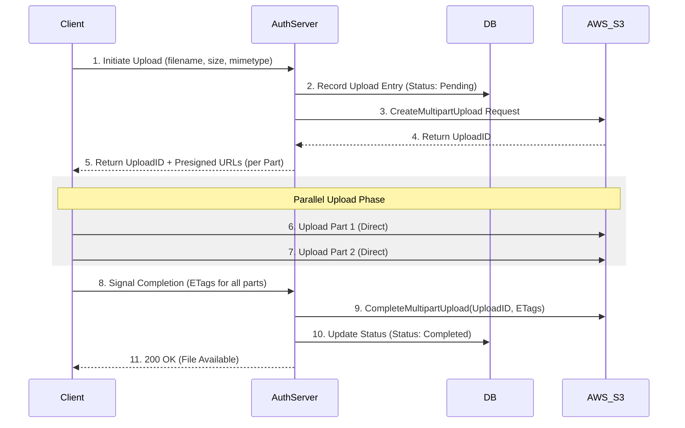

# High-Level Design: Handling 5TB Scalable File Uploads

## 1. Problem Statement
Uploading a 5TB file presents unique challenges that standard web servers (Node.js/Express) cannot handle using traditional `multipart/form-data` methods (like `multer` in RAM/Disk). 

### Key Constraints:
- **Memory/Swap Limits**: A 5TB file cannot fit in RAM or the local server disk of most application nodes.
- **Connection Timeout**: HTTP connections will likely drop during such a long-duration transfer.
- **Payload Limits**: Most API Gateways and Reverse Proxies (Nginx, AWS ALB) have a 10MB-100MB body size limit.
- **Reliability**: A network glitch at 99% (4.95TB) should not require a full restart.

---

## 2. Architecture: Direct-to-Storage (The Senior Approach)

Instead of the server acting as a "Proxy" (receiving bytes and forwarding them), the server acts as an **Orchestrator**.

### Flow Comparison:
- **Naive (Proxy)**: `Client -> Server (RAM/Temp) -> S3`. (Server dies under load).
- **Senior (Direct)**: `Client -> S3`. (Server only provides security and state management).

### Sequence Flow: S3 Presigned Multipart Upload


---

## 3. The Multipart Strategy Deep-Dive
To handle 5TB, we utilize **S3 Multipart Upload**:
1.  **Split**: Client splits the 5TB file into chunks (e.g., 100MB each).
2.  **Concurrency**: Upload multiple parts in parallel (increases throughput).
3.  **Resumability**: If Part 45 fails, the client only retries Part 45.
4.  **Finalize**: S3 concatenates all parts into a single object once the server signals completion.

---

## 4. Senior Level: Database Tracking (SQL)
Tracking the state of a 5TB upload is critical for observability and cleanup.

### Schema Design (PostgreSQL/MySQL)
```sql
-- Main record for the file
CREATE TABLE file_uploads (
    id UUID PRIMARY KEY DEFAULT uuid_generate_v4(),
    user_id UUID NOT NULL,
    filename TEXT NOT NULL,
    total_size BIGINT NOT NULL, -- BIGINT for 5TB
    mime_type VARCHAR(255),
    s3_upload_id TEXT UNIQUE,   -- From AWS
    status VARCHAR(20) DEFAULT 'pending', -- pending, uploading, completed, failed
    created_at TIMESTAMP WITH TIME ZONE DEFAULT NOW(),
    updated_at TIMESTAMP WITH TIME ZONE DEFAULT NOW()
);

-- Tracking individual parts (Optional but good for granular progress)
CREATE TABLE upload_parts (
    id UUID PRIMARY KEY,
    upload_id UUID REFERENCES file_uploads(id),
    part_number INT NOT NULL,
    etag TEXT, -- Received from S3 after part upload
    status VARCHAR(20) DEFAULT 'pending',
    UNIQUE(upload_id, part_number)
);

-- Indexing for performance
CREATE INDEX idx_uploads_user ON file_uploads(user_id);
CREATE INDEX idx_uploads_status ON file_uploads(status);
```

### Why SQL for this?
- **Atomicity**: Ensure the upload entry is created before the client starts.
- **Relationships**: Linking `upload_parts` to the main `file_uploads` allows the backend to verify that all chunks are present before calling S3's `CompleteMultipartUpload`.
- **Integrity**: Constraints prevent duplicate `UploadIDs` or overlapping `part_numbers`.

---

## 5. Security & Reliability
### A. Presigned URLs
- **Expiration**: Generate URLs that expire in 15-30 minutes.
- **Content-Length Constraints**: The URL should specify the exact size allowed for that part to prevent "overflow" attacks.

### B. Verification (Checksums)
- Client calculates `MD5` hashes for each part.
- S3 compares the `Content-MD5` header with the uploaded bytes. If they don't match, S3 rejects the part. This prevents bit-rot during the 5TB transfer.

### C. Transfer Acceleration
- Enable **S3 Transfer Acceleration** to use AWS Edge Locations. This routes the 5TB traffic over the optimized AWS backbone instead of the public internet.

### D. Exponential Backoff
- Network jitter is guaranteed for a 5TB file. The client must implement a retry mechanism with jitter to avoid slamming S3 during outages.
```
